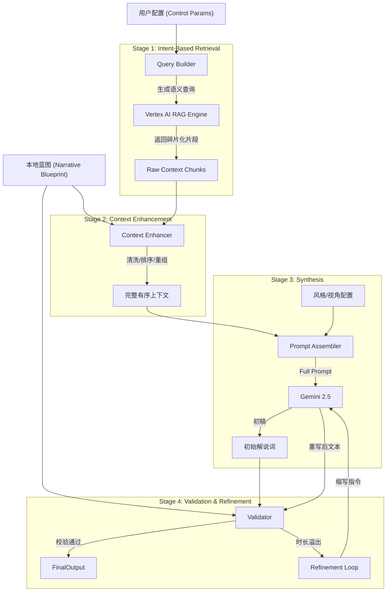

# 智能解说词生成引擎 (Narration Generator V2) 详细设计文档 
 
版本: 2.0 
最后更新: 2025-11-20 
状态: 已发布 (Released) 
模块路径: ai_services/narration/ 
 
--- 
 
## 1. 概述 (Overview) 
 
### 1.1 背景与目标 
在长视频解说或短视频切片场景中，单纯依靠 RAG（检索增强生成）往往面临“上下文碎片化”、“逻辑乱序”和“风格单一”等问题。 
Narration Generator V2 旨在通过引入 “四段式编排架构” (Four-Stage Orchestration)，将非结构化的剧情素材转化为高质量、风格化且严格符合声画时长的视频解说文案。 
 
### 1.2 核心能力 
* 有目的检索: 基于用户意图（情感/悬疑/搞事业）动态构建查询，而非千篇一律的通用摘要。 
* 时序增强: 利用本地人工标注的蓝图数据，强制纠正 RAG 返回的乱序片段，根除逻辑幻觉。 
* 风格化生成: 支持动态注入人设（如“毒舌博主”、“深情电台”），并支持第一人称沉浸式解说。 
* 声画对位校验: 内置物理时长校验器，自动计算预估朗读时长，并在溢出时触发自我修正（Refinement Loop）。 
 
--- 
 
## 2. 系统架构 (Architecture) 
 
### 2.1 数据流图 (Data Flow) 



 
### 2.2 模块清单 
 
| 模块文件 | 类名 | 职责描述 | 
| :--- | :--- | :--- | 
| narration_generator_v2.py | NarrationGeneratorV2 | 核心编排器。负责串联四个阶段，管理依赖注入和生命周期。 | 
| query_builder.py | NarrationQueryBuilder | Stage 1。负责解析 control_params，加载 query_templates.json，构建 RAG 查询。 | 
| context_enhancer.py | ContextEnhancer | Stage 2。负责从 RAG 返回的 URI 中提取 Scene ID，回查本地蓝图，进行去重、过滤和排序。 | 
| validator.py | NarrationValidator | Stage 4。负责计算物理时长与音频时长的差值，判断是否需要重写。 | 
 
--- 
 
## 3. 详细设计 (Detailed Design) 
 
### 3.1 Stage 1: 有目的检索 (Query Builder) 
* 输入: series_name, control_params (focus, scope, character) 
* 逻辑: 
 1. 加载 metadata/query_templates.json。 
 2. 根据 narrative_focus 选择基础模版（如“情感线”对应特定的关键词组合）。 
 3. 若存在 character_focus，追加“特别关注某角色”的指令。 
 4. 若存在 scope (集数范围)，追加“关注第x-y集”的软性约束。 
* 输出: 自然语言 Query String。 
 
### 3.2 Stage 2: 本地时序增强 (Context Enhancer) 
* 输入: raw_chunks (来自 RAG), narrative_blueprint.json 
* 核心算法: 
 1. 溯源 (Tracing): 正则解析 chunk.source_uri (e.g., ..._scene_16_enhanced.txt) 提取 scene_id。 
 2. 过滤 (Filtering): 根据 scope.episode_range，剔除不符合集数要求的场景 ID。 
 3. 排序 (Sorting): 利用蓝图中 narrative_timeline 的顺序对 Scene ID 进行排序。 
 4. 重组 (Reconstruction): 丢弃 RAG 的文本碎片，直接加载本地 Scene 对象的完整数据生成 Context。 
* 输出: 结构化、有序的 Markdown 文本。 
 
### 3.3 Stage 3: 风格化合成 (Synthesis) 
* 输入: enhanced_context, style, perspective, target_duration 
* Prompt 组装策略 (4-Slot Assembly): 
 * {perspective}: 身份设定（上帝视角/第一人称）。 
 * {style}: 语言风格（幽默/深情/悬疑）。 
 * {narrative_focus}: 叙事目标与时长软约束。 
 * {rag_context}: 事实素材。 
* 输出: 初始解说词列表 (JSON)。 
 
### 3.4 Stage 4: 校验与精调 (Validation & Refinement) 
* 逻辑: 
 1. 计算 Visual Duration: 累加 source_scene_ids 对应的物理时长（End Time - Start Time）。 
 2. 预测 Audio Duration: 字符数 / speaking_rate (默认 4.2字/秒)。 
 3. 判断: 若 Audio > Visual，触发 Refinement。 
* Refinement Loop: 
 * 使用 narration_refine_*.txt 模版。 
 * 要求 LLM 在保持原风格的前提下，将文本压缩至 visual_duration 秒以内。 
 * 最大重试次数：MAX_REFINE_RETRIES (默认 2 次)。 
 
--- 
 
## 4. 配置说明 (Configuration) 
 
### 4.1 配置文件结构 (ai_services/narration/metadata/) 
 
* query_templates.json: 定义 Stage 1 的 RAG 查询组装规则。 
* styles.json: 定义 Stage 3 的 LLM 语言风格预设。 
* perspectives.json: 定义 Stage 3 的视角设定（第一/第三人称）。 
 
### 4.2 Prompt 模板 (ai_services/narration/prompts/) 
 
* narration_generator_{lang}.txt: 核心生成模版，包含 4 个插槽。 
* narration_refine_{lang}.txt: 缩写修正模版，强制 JSON 输出。 
 
--- 
 
## 5. 接口契约 (API Contract) 
 
### 5.1 核心参数 (service_params.control_params) 
 
```json 
{ 
 "narrative_focus": "romantic_progression", // 叙事焦点 
 "scope": { 
 "type": "episode_range", 
 "value": [1, 5] // 剧情范围 [开始集, 结束集] 
 }, 
 "character_focus": { 
 "mode": "specific", 
 "characters": ["车小小", "楚昊轩"] // 角色聚焦 
 }, 
 "style": "humorous", // 语言风格 
 "perspective": "third_person", // 叙事视角 
 "target_duration_minutes": 5 // 目标总时长 (软约束) 
} 
```
 
### 5.2 全局参数 (service_params) 
 
* speaking_rate: (float) 语速校验标准，默认 4.2。 
* rag_top_k: (int) RAG 检索数量，建议 50-100 以覆盖长跨度剧情。 
 
--- 
 
## 6. 扩展指南 (Extension Guide) 
 
* 添加新风格: 修改 metadata/styles.json，无需改代码。 
* 添加新叙事模式: 修改 metadata/query_templates.json 中的 focus 字段。 
* 调整校验严格度: 在 NarrationValidator 中调整溢出阈值或 speaking_rate。